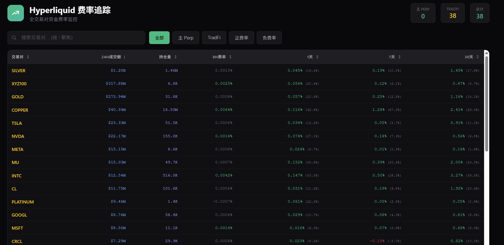
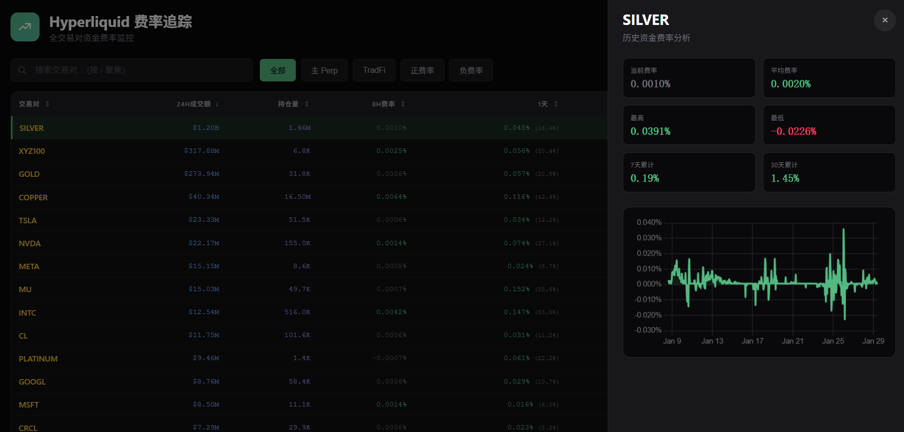

# Hyperliquid Funding Rate Tracker

Track historical funding rates for all Hyperliquid perpetual contracts, including HIP-3 TradeFi assets (stocks, commodities, forex).

## Features

- 📊 Fetch 30-day funding rate history for all assets
- 💹 Support for HIP-3 TradeFi assets (TSLA, NVDA, GOLD, etc.)
- 📈 24H Volume and Open Interest display
- 🔍 Interactive HTML report with search and sort
- 📱 Annualized rate calculation

## Usage

```bash
# Install dependencies
pip install requests

# Run (HIP-3 TradeFi only, ~38 assets)
python hype_funding_tracker.py

# Include main Perp assets (~266 assets total)
python hype_funding_tracker.py --main-perp
```

## Output

Generates `hype_funding_report.html` with:

- Sortable columns: Volume, OI, 8H Rate, 1D/7D/30D cumulative
- Annualized rates in parentheses
- Click any row for detailed chart view

## Screenshots





## License

MIT
